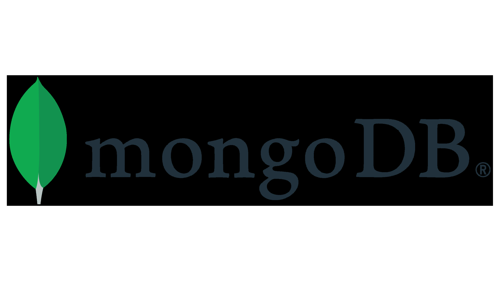
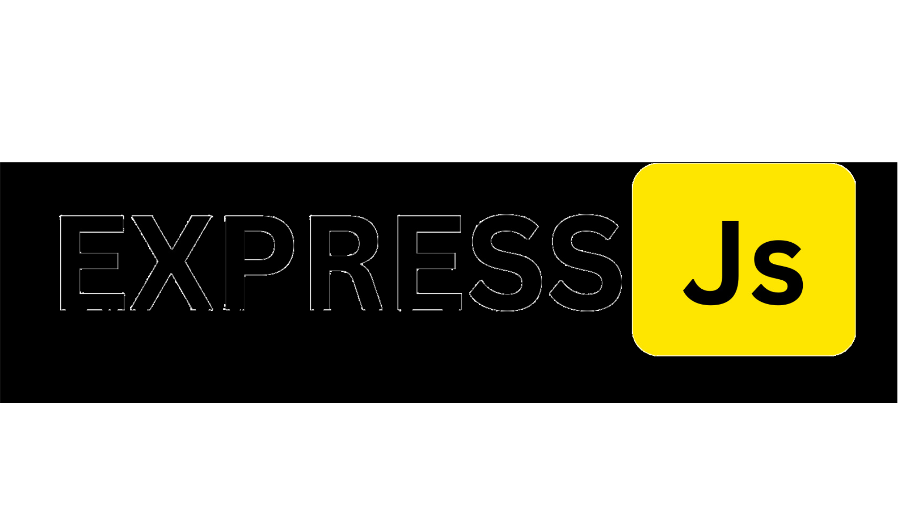
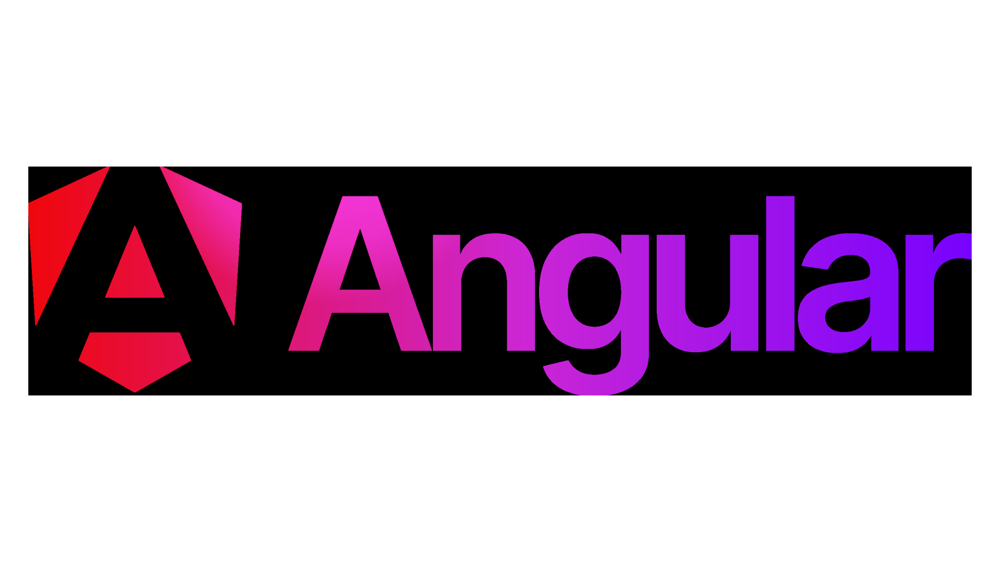
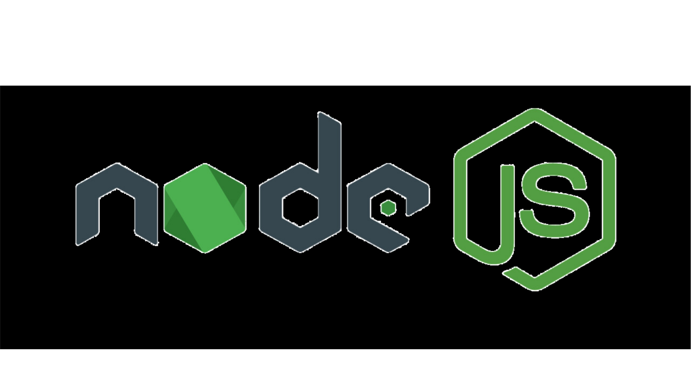
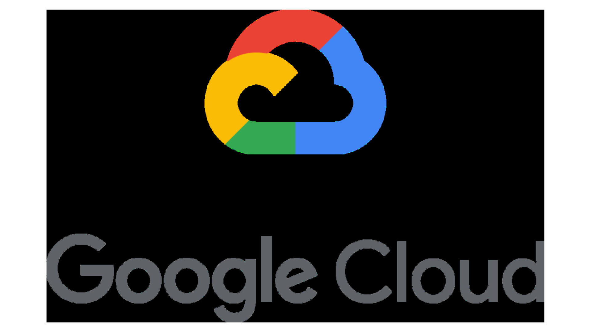
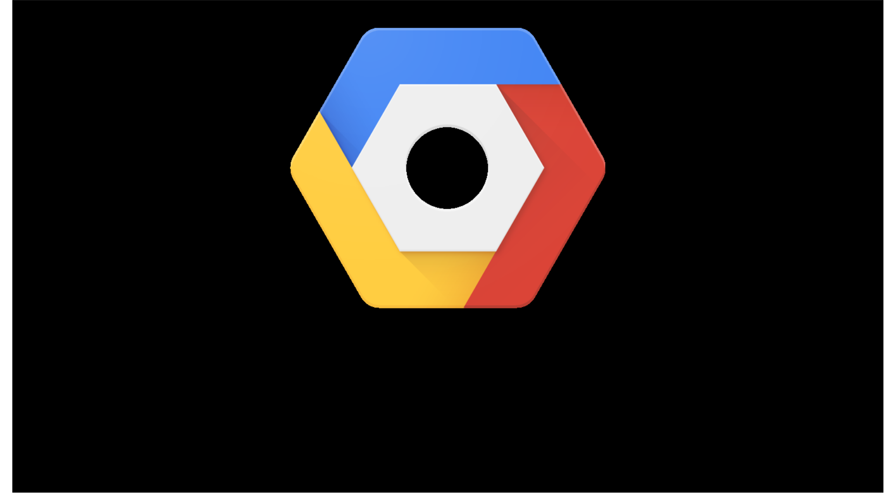

# Professional Portfolio

## Project Overview

<strong>This repository is the backbone of a major full-stack web development project, crafted specifically to be the highlight of my resume portfolio. It uses the MEAN stack (MongoDB, Express.js, Angular, Node.js) to showcase a wide range of abilities and experiences in web development. The project not only demonstrates skills in building and managing websites but also covers a variety of Computer Science fundamentals, from basic systems design to complex algorithms. This diverse expertise reflects a well-rounded understanding of the digital world, making this portfolio a true representation of my professional journey in web development and computer science.

  

## Project Updates

4/12/2024

- Currently focusing on deploying the project through AWS for accessibility via a custom domain.
- Anticipated deployment timeframe is short, enabling swift progression to the implementation of the final project.
- Learning from previous experience, starting development with backend components for smoother integration.
- Utilizing the entire MEAN stack and its components for maximum efficiency and functionality.
- Key features include:
  - Portfolio page
  - Contact page
  - User authentication system with a login feature, enabling resume download for registered users.
  - Integration of capstone project and other relevant GitHub repositories into the projects page.
  - Skills page highlighting diverse computer science experiences and proficient tool usage.
  - Outlook page, offering insights into personal passions and career aspirations within the field.

4/22/2024

- Refocused on main project and pushing off deployment since Capstone took too long. 
- Currently trying to restructure my user accounts feature and webpage navigation. 
- My overall goal is to have a administrtion side and a 'guest' side so that I can see who has visited.
- Utilizing the entire MEAN stack and its components for maximum efficiency and functionality.
- UPDATED Key features include:
  - Portfolio Landing Page
  - Administration Login Page allowing priveledged access to accounts management.
  - User authentication system, enabling resume downloading for registered users after filling out a form.
  - Integration of capstone project and other relevant GitHub repositories into the projects section.
  - Skills section highlighting diverse computer science experiences and proficient tool usage.
  - Resume download section, offering insights into personal passions and career aspirations within the CS field.

4/30/2024

- Main Page is coming along. Now need to add a projects section and then a place to download the resume. 
- Currently finishing up the about section. 
- My overall goal is to have a administrtion side and a 'guest' side so that I can see who has visited.
- Utilizing the entire MEAN stack and its components for maximum efficiency and functionality.
- UPDATED Key features include:
  - Portfolio Landing Page
  - Administration Login Page allowing priveledged access to accounts management.
  - User authentication system, enabling resume downloading for registered users after filling out a form.
  - Integration of capstone project and other relevant GitHub repositories into the projects section.
  - Skills section highlighting diverse computer science experiences and proficient tool usage.
  - Resume download section, offering insights into personal passions and career aspirations within the CS field.
- NEW! Stretch Goal
  - I would still like to deploy my site by presentation day.

5/3/2024

- The main page is now complete, with styling and animations mostly finished, except for window resizing adjustments.
- Resume download functionality has been set up.
- The site utilizes the entire MEAN stack to maximize efficiency and functionality.
- Key features include:
  - A portfolio landing page.
  - An administration login page allowing privileged access for account management.
  - A user authentication system that enables resume downloading for registered users after form submission.
  - Integration of capstone projects and other relevant GitHub repositories into the projects section.
  - A skills section showcasing diverse computer science expertise and proficient use of tools.
  - A resume download section that provides insights into personal passions and career aspirations within the computer science field.
- Stretch Goals:
  - Aim to deploy the site by presentation day.
  - Plan to implement an administration field and utilize two tables for tracking.

5/5/2024

- BIG UPDATE!!
- The entire repository has been restarted, based on class examples, after encountering critical errors with the implementation of user authentication.
- User authentication and passport are now fully implemented with my user login.
- All pages have been implemented, with most page styling completed.
= UPDATED Key features include:
  - A portfolio landing page that supports user resume downloads.
  - An administration login page allowing privileged access for account management.
  - A user authentication system that enables resume downloading for registered users after form submission.
  - Admin management controlled on the Management page where all requests populate and can be managed.
  - Resume downloads are managed through a form and can be tracked on the Dashboard page, with options for deletion.
  - An Accounts page where the admin can change their account information or delete their account.
  - Significant project-wide styling updates.
- Stretch Goals:
  - Aim to deploy the site by presentation day.
  - Implement route guards by presentation day.

## Tools Utilization

### MongoDB

  

MongoDB is a powerful NoSQL database that allows for flexible and scalable data storage. Its document-oriented data model makes it ideal for handling complex, unstructured data commonly encountered in web applications. MongoDB's features include high availability, horizontal scaling, and a rich query language, providing developers with the tools needed to build robust backend systems.

### Express.js

  

Express.js is a minimal and flexible web application framework for Node.js, providing a robust set of features for building web applications and APIs. With Express.js, developers can easily create server-side applications, define routes, handle middleware, and manage HTTP requests and responses. Its simplicity and extensibility make it a popular choice for building RESTful APIs and web servers.

### Angular

  

Angular is a powerful front-end framework developed and maintained by Google. It simplifies the development of dynamic, single-page web applications by providing a comprehensive toolkit for building reusable components, managing state, and handling user interactions. Angular's features include two-way data binding, dependency injection, and a modular architecture, enabling developers to create scalable and maintainable applications with ease.

### Node.js

  

Node.js is a server-side JavaScript runtime environment that allows developers to run JavaScript code outside of a web browser. It provides a non-blocking, event-driven architecture, making it suitable for building fast and scalable network applications. Node.js comes with a rich ecosystem of libraries and frameworks, making it a popular choice for building backend services, APIs, and real-time applications.

### Google Cloud

  

Google Cloud is a suite of cloud computing services offered by Google. It provides a range of hosting and cloud computing tools for developers, including computing power, data storage solutions, and machine learning capabilities. With its robust infrastructure and powerful analytics, Google Cloud enables businesses to scale and innovate, while efficiently managing their resources in a secure, highly reliable, and high-performance environment.

### Google Cloud Platform

  

Google Cloud Platform (GCP) offers a comprehensive set of cloud-based services that allow developers to build, test, and deploy applications on Google's highly-scalable and reliable infrastructure. GCP provides various services such as compute engines, container tools, networking, big data solutions, and APIs for machine learning. This platform supports rapid development and allows organizations to leverage Google’s technologies to create powerful applications and data analysis solutions.

## Contributors

- [Collin Streitman](https://github.com/CStre)

For any inquiries or collaborations, please feel free to contact me. I welcome contributions and feedback from the community to enhance the project further.

## License

This project is licensed under the [MIT License](LICENSE.md), granting permission for widespread use and modification, with proper attribution to the original source.

